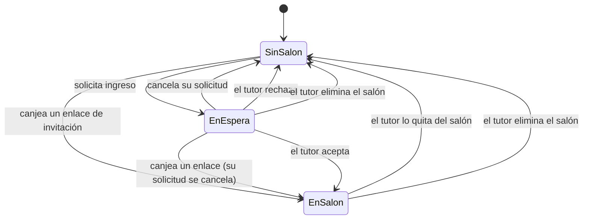

# CodePlay — Estado del proyecto

> Documento de referencia para retomar el desarrollo sin perder contexto.
> Última actualización: **3 de septiembre de 2026**.

CodePlay es una plataforma web para enseñar pensamiento computacional a niños,
con un juego de Unity que se integrará más adelante. Este documento mapea qué
está construido, cómo se ve y con qué está hecho.

**Lo primero que hay que entender:** la aplicación **está conectada a un backend
real**. Hay un proyecto de Supabase con su esquema aplicado —22 migraciones—, el
acceso y el registro son de verdad, y los salones se guardan en la base y se
sincronizan entre dispositivos. Lo que aún no existe es **el juego**: nada
escribe progreso, XP ni rachas, así que todas esas cifras muestran el cero
verdadero.

Si vienes de una versión anterior de este documento: decía que no había backend
y que los salones vivían en `localStorage`. Eso dejó de ser cierto a finales de
agosto de 2026.

**Los otros documentos, y cuándo leer cada uno**

| Documento | Para qué |
| --- | --- |
| **Este** | Qué hay construido, cómo se ve y con qué está hecho. **La §2 es la guía de estilos completa: es la referencia al tocar interfaz** |
| [`CONTEXT.md`](CONTEXT.md) | El estado al detalle, decisión por decisión, y la deuda técnica con su medición. Más largo y más técnico que este |
| [`ROADMAP.md`](ROADMAP.md) | En qué orden se construye y qué falta |
| [`CONTRATO-DE-INTEGRACION.md`](CONTRATO-DE-INTEGRACION.md) | Qué debe cumplir el juego. **Se lee sin conocer este repositorio** |
| [`../supabase/README.md`](../supabase/README.md) | Detalle migración por migración |

---

## Índice

1. [Mapa de funcionalidades](#1-mapa-de-funcionalidades)
2. [Guía de estilos](#2-guía-de-estilos)
3. [Herramientas y stack](#3-herramientas-y-stack)
4. [Deuda técnica conocida](#4-deuda-técnica-conocida)

---

## 1. Mapa de funcionalidades

### Leyenda

| Símbolo | Significado |
| --- | --- |
| ✅ **Funcional** | Implementado y operativo **contra la base real**. Persiste y se ve desde otro dispositivo. |
| 🟡 **Prototipo** | La interfaz existe y responde, pero no produce el efecto real: son datos de ejemplo escritos en el cliente, o una acción que no llega a ninguna parte. |
| ⛔ **Pendiente** | No existe todavía. |

### 1.1 Rol Tutor

El rol se llama `tutor` en el código y cubre tanto a **padres como a profesores**.
En la interfaz se etiqueta "Tutor"; el nombre del profesor se muestra por salón.

| Funcionalidad | Estado | Dónde vive |
| --- | --- | --- |
| Listado de salones con métricas agregadas | ✅ | `TeacherGroupsModule.tsx` |
| Crear salón (nombre, grado, profesor, cupos) | ✅ | `CreateGroupForm.tsx` |
| Generación de ID público único por salón | ✅ | `generatePublicId()` en `classroomsData.ts` |
| Identidad visual automática por salón | ✅ | `groupThemes.ts` + `GroupBadge.tsx` |
| Detalle del salón con estadísticas | ✅ | `TeacherGroupDetailModule.tsx` |
| Eliminar alumno del salón (con confirmación en línea) | ✅ | `StudentRosterTable.tsx` |
| Eliminar salón (diálogo con recuento de afectados) | ✅ | `ConfirmDialog.tsx` |
| Bandeja "Alumnos en espera" | ✅ | `PendingRequestsSection.tsx` |
| Aceptar / rechazar solicitud de ingreso | ✅ | `ClassroomsProvider.tsx` — aceptar respeta el cupo y no se puede saltar |
| Selector de alcance (todos los salones / uno) | ✅ | `TeacherPanelModule.tsx` |
| Asignación de misiones | ✅ | Persiste en la base (`mission_assignments`). **Pero nadie puede cumplirlas**: sin juego no hay forma de completar una, así que el salón entero sale en «Pendiente» con el motivo escrito en la pantalla |
| Enlace de invitación que lleva al salón | ✅ | El tutor genera un enlace y lo comparte por donde quiera; quien lo abre entra **sin pasar por la bandeja**. Caduca a los 14 días |
| Invitar alumnos por correo | ⛔ | El enlace se comparte a mano. **Enviarlo automáticamente requiere contratar un servicio de correo**, y ninguna tabla guarda direcciones a propósito |
| La bandeja se actualiza sola | ✅ | Si un niño solicita mientras el panel está abierto, la solicitud aparece sin recargar |
| Ajustes de cuenta | ✅ | Cambiar el nombre y cambiar la contraseña funcionan de verdad |
| Reportes de habilidades (5 competencias) | 🟡 | `getSkillReports()` — **calculado sobre datos de ejemplo.** Necesita progreso real, que llega con el juego |
| Tabla de seguimiento (mundo, actividad, racha) | 🟡 | La estructura es real, pero mundo, actividad y racha son de ejemplo. El XP sí es el de la base: hoy, cero |
| Recursos educativos | 🟡 | Tarjetas informativas sin destino |
| Editar o archivar un salón existente | ⛔ | — |
| Exportar reportes | ⛔ | — |

### 1.2 Rol Alumno (niño)

| Funcionalidad | Estado | Dónde vive |
| --- | --- | --- |
| Buscador global de salones | ✅ | `StudentClassroomSearch.tsx` |
| Búsqueda por nombre (coincidencia parcial) | ✅ | `matchesGroupSearch()` |
| Búsqueda por ID exacto (muestra solo ese salón) | ✅ | `matchesGroupSearch()` + `isExactIdSearch()` |
| Solicitar ingreso a un salón | ✅ | `requestJoin()` |
| Pantalla de espera con cancelación | ✅ | `StudentClassroomModule.tsx` |
| Ver el salón propio y a los compañeros | ✅ | `StudentClassroomModule.tsx` |
| Bloqueo de solicitud si el salón está lleno | ✅ | `StudentClassroomSearch.tsx` |
| Entrar por un enlace de invitación | ✅ | `pages/Invite/Invite.tsx` — el token sobrevive registrarse, incluso pasando por Google |
| Ver sus misiones asignadas | ✅ | Ve sólo lo que su tutor asignó a su salón. **No puede jugarlas**: no hay botón, porque no hay juego |
| Su salón se actualiza solo | ✅ | Ve que lo aceptan, lo rechazan o lo quitan sin recargar |
| Ajustes de cuenta | ✅ | `StudentSettingsModule.tsx` — cambiar nombre y contraseña funcionan |
| Listado de mundos | ✅ | `StudentWorldsModule.tsx` — los 3 mundos vienen de la base. La **dificultad** sí está escrita a mano: los tres dicen «Fácil» |
| Sala de trofeos | 🟡 | `StudentTrophiesModule.tsx` — lee de la base, pero **sólo lista lo conseguido**: no existe el catálogo de logros posibles, así que hoy está vacía |
| Niveles de un mundo | 🟡 | `StudentWorldLevelsModule.tsx` — **maqueta pura, y con un defecto conocido**: enseña 10 niveles inventados y siempre los del *mismo* mundo, sea el que sea el que elijas. Lo arregla el paso 20 |
| Jugar (juego de Unity) | ⛔ | El proyecto de Unity todavía no existe |
| Progreso, XP y rachas reales | ⛔ | La fontanería está escrita y medida, pero **nada la llama**: llega con el juego. El XP se ve en cuatro sitios y muestra cero |

> **Un niño pertenece a un solo salón, y eso es una decisión de diseño, no una
> limitación pendiente de resolver.** No es que «todavía» no se pueda estar en
> varios: el modelo lo impide a propósito, y lo hace cumplir el servidor en tres
> sitios a la vez —una restricción de unicidad sobre la pertenencia, un índice
> único sobre las solicitudes pendientes, y la propia política de escritura, que
> rechaza pedir entrar a otro salón siendo ya miembro—. Ninguno de los tres
> sobra.
>
> Si algún día se quisiera cambiar, no sería añadir una funcionalidad: sería
> rehacer el modelo de pertenencia y todo lo que cuelga de él. **Nadie lo ha
> pedido y no está en el roadmap.**

### 1.3 Transversal

| Funcionalidad | Estado | Notas |
| --- | --- | --- |
| Enrutado y guardas por rol | ✅ | Cada rol es devuelto a su panel si entra en el ajeno |
| Registro y login reales | ✅ | Contra Supabase Auth. El rol se elige al registrarse |
| Login con Google | ✅ | Funciona por los dos caminos. **El rol se fija en el primer registro y no cambia nunca** |
| Recuperar la contraseña olvidada | ✅ | Correo real con enlace, verificado de punta a punta |
| Cambiar la contraseña desde Ajustes | ✅ | Pide la actual y la verifica contra el servidor |
| Cambiar el nombre desde Ajustes | ✅ | Se refresca en las siete pantallas que lo muestran, sin recargar |
| Persistencia del estado de salones | ✅ | **En Supabase**, no en el navegador: se ve desde cualquier dispositivo |
| Sincronización en vivo | ✅ | Tres pantallas se actualizan solas. **No hay notificaciones**: ni campana, ni avisos, ni no leídos |
| Sesión de invitado (entrar sin login) | ✅ | Sólo en desarrollo (`import.meta.env.DEV`). **Ya no simula nada**: autentica de verdad con cuentas de prueba |
| Mensajes de error en español | 🟡 | Los de acceso sí. Los de perfil siguen llegando en inglés |
| Responsive y accesibilidad | ⛔ | **El panel no se repliega en móvil.** A 375 px la barra lateral se come la pantalla. Es el paso 25 |
| Consentimiento del acudiente y política de privacidad | ⛔ | Obligatorio antes del primer usuario real. Es el paso 14 |

### 1.4 Flujos de usuario principales

#### Crear salón

```
Tutor → "Mis salones" → botón "Crear salón"
  → formulario (nombre, grado, profesor, cupos 1-60)
  → validación en cliente
  → createGroup(): genera id interno + publicId único (CP-XXXX) + tema visual
  → se añade al store y redirige a /teacher/groups/{id}
```

#### Invitar con un enlace

```
Tutor → detalle del salón → "Invitar"
  → createInvitation(): el servidor genera un token y lo devuelve en la misma llamada
  → el tutor copia el enlace /invite/{token} y lo comparte por donde quiera
  → aparece en la lista con uno de tres estados: activo, usado o caducado
  → caduca a los 14 días, y al abrir el panel se purgan los vencidos

Quien abre el enlace:
  → si no tiene cuenta, se registra; el token sobrevive el registro,
    incluso pasando por Google
  → redeem_invitation(): entra al salón SIN pasar por la bandeja del tutor
  → si tenía una solicitud pendiente en otro salón, se cancela
  → si ya estaba en un salón, no entra y el enlace NO se gasta

La plataforma no manda ningún correo: ninguna tabla guarda direcciones,
y eso es una decisión de privacidad, no una funcionalidad a medias.
```

#### Solicitar ingreso

```
Alumno sin salón → buscador → busca por nombre o ID
  → "Solicitar ingreso"
  → requestJoin(): crea JoinRequest en el salón + membership = pending
  → el alumno ve la pantalla de espera
  → la solicitud aparece en la bandeja del tutor de ese salón
```

#### Aprobar o rechazar solicitud

```
Tutor → detalle del salón → "Alumnos en espera"
  ├── Aceptar  → accept_join_request(): el servidor comprueba el cupo, que el
  │              salón sea suyo y que el niño no esté ya en otro, y escribe
  │              las dos tablas en una sola transacción
  └── Rechazar → rejectRequest(): la solicitud queda rechazada, y es inmutable
                 — el niño no puede borrarla ni reescribirla

El niño lo ve sin recargar, esté donde esté.

Nota: "Aceptar" se deshabilita cuando no quedan cupos libres, y aunque se
fuerce la llamada, el servidor la rechaza con "Classroom is full".
```

#### Eliminar alumno

```
Tutor → tabla de seguimiento → "Quitar"
  → confirmación en línea (Confirmar / Cancelar)
  → removeStudent(): sale de la tabla y los contadores se recalculan
  → si es el alumno de la sesión → membership = none
```

#### Eliminar salón

```
Tutor → detalle del salón → "Eliminar salón"
  → diálogo modal indicando cuántos alumnos y cuántas solicitudes se ven afectados
  → deleteGroup(): el salón desaparece del store
  → todos sus alumnos quedan sin salón
  → si el alumno de la sesión estaba dentro → membership = none
  → redirige a /teacher/groups
```

### 1.5 Estados del alumno



**El enlace de invitación es el único camino que salta la espera.** Entra
directo, y si el niño tenía una solicitud pendiente —en ese salón o en otro— se
**cancela**: ni se acepta ni se rechaza. Su historial de solicitudes ya
resueltas no se toca.

| Estado | `membership.status` | `groupId` | Qué ve el alumno |
| --- | --- | --- | --- |
| Sin salón | `none` | `null` | Buscador global de salones |
| En espera | `pending` | id del salón | Pantalla de espera con opción de cancelar |
| En un salón | `member` | id del salón | Su salón, compañeros y seguimiento |

**Transiciones**

| Desde | Hacia | Disparador | Quién |
| --- | --- | --- | --- |
| Sin salón | En espera | `requestJoin()` | Alumno |
| Sin salón / En espera | En un salón | `redeemInvitation()` | Alumno, con un enlace |
| En espera | Sin salón | `cancelJoinRequest()` | Alumno |
| En espera | Sin salón | `rejectRequest()` | Tutor |
| En espera | En un salón | `acceptRequest()` | Tutor |
| En un salón | Sin salón | `removeStudent()` | Tutor |
| En espera / En un salón | Sin salón | `deleteGroup()` | Tutor |

> No existe transición directa de "En un salón" a "En espera" en otro salón:
> el alumno debe quedar sin salón primero.

---

## 2. Guía de estilos

Referencias estéticas: **CodeCombat, CodeMonkey y Scratch**. La idea rectora es
que todo se vea *tangible* — contornos gruesos, relieve sólido, colores
saturados — en lugar de una interfaz plana y genérica.

Los tokens viven en [`apps/web/src/main.css`](../apps/web/src/main.css) como
variables CSS y en [`apps/web/tailwind.config.js`](../apps/web/tailwind.config.js)
como nombres de Tailwind. **Usa siempre los nombres, no los hex sueltos.**

### 2.1 Paleta

#### Colores de marca

| Nombre | Hex | Tailwind | Uso asignado |
| --- | --- | --- | --- |
| Uva | `#7B3FE4` | `grape` | **Primario.** Acciones principales, navegación activa, títulos |
| Uva oscuro | `#5620B0` | `grape-dark` | Relieve de botones primarios, texto sobre fondo claro |
| Uva claro | `#A77BF3` | `grape-light` | Degradados, foco de campos |
| Uva suave | `#F0E6FF` | `grape-soft` | Fondos de etiquetas y botones secundarios |
| Sol | `#FFC93C` | `sun` | **Secundario.** Rachas, elementos en espera, logo |
| Sol oscuro | `#D99A00` | `sun-dark` | Texto sobre fondo ámbar |
| Sol suave | `#FFF4D6` | `sun-soft` | Fondo de avisos de atención |

#### Colores semánticos

| Nombre | Hex | Tailwind | Uso asignado |
| --- | --- | --- | --- |
| Menta | `#17C3B2` | `mint` | **Éxito.** Confirmaciones, aceptar, rol Tutor, mundo actual |
| Menta oscuro | `#0C8577` | `mint-dark` | Texto de éxito |
| Menta suave | `#D6F7F3` | `mint-soft` | Fondo de mensajes de éxito |
| Coral | `#FF5A5A` | `coral` | **Peligro.** Eliminar, rechazar, cerrar sesión |
| Coral oscuro | `#C72C2C` | `coral-dark` | Texto de error y validación |
| Coral suave | `#FFE6E6` | `coral-soft` | Fondo de alertas destructivas |
| Cielo | `#3B9DF8` | `sky` | **Informativo.** Cupos, datos neutros |
| Lima | `#7ED957` | `lime` | Barras de dominio alto (≥ 70 %) |
| Chicle | `#FF7BC2` | `bubble` | Acento decorativo y temas de salón |

#### Neutros y fondos

Todos los neutros llevan un tinte violeta deliberado: evita el gris apagado que
haría la interfaz menos infantil.

| Nombre | Hex | Tailwind | Uso asignado |
| --- | --- | --- | --- |
| Tinta | `#2A1B45` | `ink` | Texto principal **y todos los contornos** |
| Tinta suave | `#5A5170` | `ink-soft` | Texto secundario y descripciones |
| Tinta tenue | `#8B82A6` | `ink-faint` | Texto terciario, vacíos, marcadores de posición |
| Crema | `#FFF9EF` | `cream` | Fondo de campos, filas alternas, cajas internas |
| Lavanda | `#F4EEFF` | `lavender` | **Fondo de la aplicación** |
| Línea | `#E3D9F7` | `line` | Bordes suaves y lunares del fondo |

El fondo de la aplicación no es un plano liso: lleva una trama de lunares de
`line` sobre `lavender`, con `background-size: 26px 26px`.

#### Semáforo de dominio de habilidades

| Rango | Color | Lectura |
| --- | --- | --- |
| ≥ 70 % | `lime` | Dominado |
| 45 – 69 % | `sun` | En camino |
| < 45 % | `coral` | A reforzar |

### 2.2 Tipografía

| Familia | Uso | Pesos | Origen |
| --- | --- | --- | --- |
| **Fredoka** | Títulos, botones, etiquetas, números destacados | 500, 600, 700 | Google Fonts |
| **Quicksand** | Cuerpo de texto, párrafos, tablas | 500, 600, 700 | Google Fonts |

Ambas son redondeadas y de alta legibilidad. El cuerpo arranca en **peso 600**
por defecto: en una interfaz infantil el texto fino se lee peor.

Aplicación automática: `h1`–`h4` reciben Fredoka mediante una regla global en
`main.css`. Para usar Fredoka fuera de un encabezado, aplica `font-display`.

#### Jerarquía

| Clase | Tamaño | Familia | Uso |
| --- | --- | --- | --- |
| `.title-xl` | 32 px | Fredoka | Título de página (`h1`) |
| `.title-lg` | 24 px | Fredoka | Título de sección (`h2`) |
| — | 19–24 px | Fredoka | Títulos de tarjeta (`h3`) |
| `.subtitle` | 16 px | Quicksand 600 | Descripción bajo un título |
| — | 16 px | Quicksand 600–700 | Cuerpo y celdas de tabla |
| — | 14–15 px | Quicksand 600 | Texto secundario |
| `.field-label` | 14 px | Quicksand 700 | Etiquetas de formulario |
| — | 13 px / mayúsculas | Quicksand 700 | Encabezados de dato, `tracking: 0.05em` |

### 2.3 Componentes reutilizables

#### Botones — clases CSS

Base `.btn` + un modificador de color. Miden **52 px** de alto (40 px con
`.btn-sm`), tienen redondeo completo y un **borde inferior de 5 px** en el tono
oscuro que produce el relieve.

| Clase | Color | Uso |
| --- | --- | --- |
| `.btn .btn-grape` | Uva | Acción principal |
| `.btn .btn-mint` | Menta | Confirmar, aceptar |
| `.btn .btn-sun` | Sol | Acción destacada secundaria (texto en tinta) |
| `.btn .btn-coral` | Coral | Destructiva |
| `.btn .btn-sky` | Cielo | Informativa |
| `.btn .btn-ghost` | Uva suave | Secundaria, cancelar |
| `.btn-sm` | — | Modificador de tamaño reducido |

**Estados:** `hover` aplica `brightness(1.06)`; `active` baja el botón 3 px y
reduce el borde inferior a 2 px — el relieve se hunde de verdad; `disabled`
aplica escala de grises al 50 % y opacidad 0,65.

#### Tarjetas

| Clase | Descripción |
| --- | --- |
| `.card` | Contorno de 3 px en tinta, radio 26 px, sombra sólida `0 8px 0` — aspecto de pegatina |
| `.card-flat` | Variante ligera: borde de 2 px en `line`, radio 22 px, sin sombra |

#### Etiquetas de estado

Base `.chip` (Fredoka 13 px, radio completo) más color: `.chip-grape`,
`.chip-mint`, `.chip-sun`, `.chip-coral`, `.chip-sky`.

| Etiqueta | Color | Significado |
| --- | --- | --- |
| Tutor | menta | Rol del usuario |
| En espera / Pendiente | sol | Solicitud o invitación sin resolver |
| Dificultad de misión | uva | Fácil / Intermedio / Difícil |
| Habilidad | menta | Competencia que entrena una misión |

#### Campos de formulario

`.field` — 52 px de alto, fondo crema, borde de 3 px en `line`, radio 16 px. Al
enfocar, el borde pasa a `grape-light` y el fondo a blanco. Etiquetas con
`.field-label`.

#### Componentes React compartidos

| Componente | Ruta | Función |
| --- | --- | --- |
| `ConfirmDialog` | `components/dashboard/shared/` | Modal de confirmación destructiva. Cierra con Escape o clic fuera |
| `StatCard` | `components/dashboard/shared/` | Métrica con icono en burbuja. Prop `tone` |
| `StudentRosterTable` | `components/dashboard/shared/` | Tabla de seguimiento. La columna de acciones solo aparece si se pasa `onRemoveStudent` |
| `GroupBadge` | `components/dashboard/shared/` | Insignia ilustrada del salón según su tema |

#### Identidad visual de los salones

Cada salón recibe uno de **seis temas** de forma determinista, mediante hash de
su id (`getGroupTheme()`). No se guarda en base de datos: el mismo salón siempre
obtiene el mismo tema.

| Tema | Color | Hex |
| --- | --- | --- |
| Cohete | Uva | `#7B3FE4` |
| Robot | Cielo | `#3B9DF8` |
| Dinosaurio | Lima | `#7ED957` |
| Estrella | Sol | `#FFC93C` |
| Bosque | Menta | `#17C3B2` |
| Océano | Chicle | `#FF7BC2` |

Cada tema aporta color sólido, degradado de cabecera (135°, claro → saturado) y
una **ilustración SVG propia**, presente en la tarjeta, la barra lateral y la
vista del alumno.

### 2.4 Espaciado, radios y sombras

#### Radios

| Valor | Uso |
| --- | --- |
| `9999px` | Botones, etiquetas, avatares, barras de progreso |
| `26px` | Tarjetas principales (`.card`, `rounded-chunk`) |
| `20–22px` | Insignias, cajas internas, `.card-flat` |
| `16–18px` | Campos, elementos de navegación, avisos |

#### Sombras

Nunca difuminadas: siempre desplazamiento sólido en vertical, que es lo que
produce la sensación de relieve.

| Token | Valor | Uso |
| --- | --- | --- |
| `shadow-chunk` | `0 8px 0 rgba(42,27,69,0.12)` | Tarjetas |
| `shadow-chunk-lg` | `0 12px 0 rgba(42,27,69,0.14)` | Elementos elevados |
| — | `0 4px 0 rgba(42,27,69,0.15–0.25)` | Insignias, navegación activa |
| — | `0 16px 0 rgba(42,27,69,0.18)` | Modales |

#### Espaciado

Escala de 4 px (la de Tailwind). Ritmos habituales:

| Contexto | Valor |
| --- | --- |
| Relleno de página | `px-5 py-5` (20 px) |
| Relleno de tarjeta | `px-5 py-4` a `p-6` |
| Separación entre secciones | `mt-6` a `mt-8` (24–32 px) |
| Rejilla de tarjetas | `gap-5` / `gap-6` |
| Grupos de botones | `gap-3` |
| Altura de barras superiores | 84 px |
| Ancho de barras laterales | 262 px |
| Grosor de contornos | 3 px estructural, 2 px secundario |

---

## 3. Herramientas y stack

### 3.1 Versiones

Entorno de referencia: **Node.js 22.17.1**, **npm 10.9.2**.

#### Núcleo

| Paquete | Versión | Para qué |
| --- | --- | --- |
| `react` / `react-dom` | 18.3.1 | Interfaz |
| `react-router-dom` | 6.30.6 | Enrutado |
| `typescript` | 5.9.3 | Tipado, modo estricto |
| `vite` | 5.4.21 | Servidor de desarrollo y empaquetado |
| `@vitejs/plugin-react` | 4.7.0 | Fast Refresh y JSX |
| `tailwindcss` | 3.4.19 | Estilos |
| `postcss` / `autoprefixer` | 8.5.26 / 10.5.4 | Procesado de CSS |

#### Backend y validación

| Paquete | Versión | Para qué |
| --- | --- | --- |
| `@supabase/supabase-js` | 2.112.3 | **En uso real.** Cliente y 8 servicios contra un proyecto conectado |
| `zod` | 3.25.76 | Valida las variables de entorno y los formularios de acceso |

> `framer-motion` **ya no está**: se eliminó porque nada lo usaba.

#### Tests

| Paquete | Versión | Para qué |
| --- | --- | --- |
| `vitest` | 3.2.7 | Ejecutor de tests |
| `jsdom` | 30.0.1 | DOM simulado |
| `@testing-library/react` | 16.3.2 | Renderizar componentes y buscar por lo que ve el usuario |

Hoy hay **109 tests en 15 archivos**, y pasan. No los rompas: existen sobre todo
para que reescribir `ClassroomsProvider` tenga red. Si uno falla después de un
cambio tuyo, **eso es la señal que se pagó por tener**; no se «arregla» tocando
el test.

#### Calidad

| Paquete | Versión |
| --- | --- |
| `eslint` | 8.57.1 (config heredada `.eslintrc.cjs`) |
| `@typescript-eslint/*` | 6.x |
| `prettier` | 3.9.6 |

> ESLint 8 dejó de recibir soporte. Migrar a ESLint 9 con configuración plana es
> una tarea pendiente sin urgencia.

### 3.2 Puesta en marcha

```bash
npm install
```

Un solo `npm install` en la raíz resuelve todos los paquetes: es un monorepo con
npm workspaces y un `node_modules` compartido.

Variables de entorno del front:

```bash
cp apps/web/.env.example apps/web/.env
```

| Variable | Descripción |
| --- | --- |
| `VITE_SUPABASE_URL` | URL del proyecto de Supabase |
| `VITE_SUPABASE_ANON_KEY` | Clave pública (anon) |

> ⚠️ **La aplicación NO arranca sin estas dos variables.** `config/env.ts` las
> valida con zod y **lanza al importarse**, así que una pantalla en blanco al
> empezar casi siempre es esto. Copiar `.env.example` da valores de relleno que
> pasan la validación, pero **no apuntan a ningún proyecto real**: para trabajar
> contra la base de verdad hay que pedirle a Andrés las credenciales, que no
> están en el repositorio.

El `.env` de quien tiene acceso lleva además seis variables `VITE_DEV_*` con las
cuentas de prueba que usa el botón «Sin login». Sin ellas ese botón cae en una
marca de invitado que no autentica contra nada.

```bash
npm run dev
```

#### Comandos

Todos desde la raíz. Para uno concreto: `npm run <script> -w @codeplay/web`.

| Comando | Qué hace |
| --- | --- |
| `npm run dev` | Servidor de desarrollo en el puerto 5173 |
| `npm run build` | Chequeo de tipos + build de producción |
| `npm run lint` | ESLint sin tolerancia a warnings |
| `npm run test` | Tests en modo vigilancia |
| `npm run test:run` | Tests, una pasada |
| `npm run preview` | Sirve el build de producción |
| `npm run format` | Prettier sobre `src` |

**Los tres que hay que dejar en verde antes de subir nada** son `lint`,
`test:run` y `build`. Se ejecutan además en GitHub Actions en cada push y en
cada pull request contra `main`.

> ⚠️ Ejecuta los tests con `npm run test:run`, **no** con `npx vitest run`: por
> la raíz se salta la configuración del workspace, no carga el DOM simulado y
> verás decenas de fallos que no existen.

Para operar sobre un workspace concreto: `npm run <script> -w @codeplay/web`.
Para instalar una dependencia solo en el front: `npm install <paquete> -w @codeplay/web`.

### 3.3 Estructura de carpetas

```
codeplayPGrado/
├── apps/
│   ├── web/                  Front-end (React + TS + Vite + Tailwind)
│   └── game/                 Proyecto de Unity (pendiente de crear)
├── packages/                 Código compartido entre apps (vacío)
├── supabase/                 Esquema de base de datos
│   └── migrations/           22 migraciones SQL (la siembra vive en la 0012,
│                             no hay seed.sql suelto)
├── docs/                     Este documento, CONTEXT.md, ROADMAP.md y
│                             CONTRATO-DE-INTEGRACION.md
├── .github/workflows/        CI: lint, tests y build
├── package.json              Raíz del monorepo (npm workspaces)
├── .eslintrc.cjs             Config de ESLint compartida
├── .prettierrc               Config de Prettier compartida
└── .gitattributes            Normalización de fin de línea + reglas de Unity
```

#### Dentro de `apps/web/src`

| Carpeta | Contenido |
| --- | --- |
| `components/dashboard/teacher/` | Todo el panel del tutor (11 archivos) y `classroomsData.ts`, que reúne los datos de ejemplo y las funciones puras de cálculo |
| `components/dashboard/student/` | Módulos del alumno: salón, buscador, mundos, trofeos, ajustes |
| `components/dashboard/shared/` | Componentes usados por ambos roles y los temas de salón |
| `components/dashboard/Sidebar/` | Barra lateral del alumno |
| `components/home/` | Navbar y secciones de la landing |
| `components/auth/`, `components/ui/` | Formularios de acceso y primitivas antiguas |
| `context/` | `AuthProvider` (Supabase), `ClassroomsProvider` (store de salones), helpers de rol y de sesión de invitado |
| `hooks/` | `useAuth`, `useClassrooms`, `useActiveRole` y los hooks de datos (`useWorlds`, `useProgress`, `useAchievements`, `useProfile`, `useInvitations`, `useMissionAssignments`) |
| `services/` | 8 servicios de Supabase, **todos en uso**. Devuelven siempre `{ data, error }` y **nunca lanzan** |
| `types/` | Tipos de dominio. `classroom.types.ts` es el modelo vivo; `database.types.ts` **se genera con la CLI de Supabase y no se edita a mano** |
| `test/` | Infraestructura de tests: `setup.ts` y `renderClassrooms.tsx` |
| `router/` | `AppRouter` y las guardas `PrivateRoute` / `PublicRoute` |
| `pages/` | Un componente por pantalla de nivel superior |
| `constants/`, `config/`, `lib/`, `errors/` | Rutas, entorno, cliente de Supabase, tipos de error |

#### Rutas

| Ruta | Rol | Pantalla |
| --- | --- | --- |
| `/` | Público | Landing |
| `/login`, `/signup` | Público | Acceso y registro |
| `/signup/child`, `/signup/tutor` | Público | Registro con el rol ya elegido |
| `/forgot-password` | Público | Pedir el correo de recuperación |
| `/reset-password` | Con sesión, sin rol | Fijar la contraseña nueva desde el enlace del correo |
| `/auth/callback` | Sin guarda | Vuelta de Google. **Sin guarda a propósito**: si el proveedor falla no hay sesión, y una guarda borraría el motivo |
| `/invite/:token` | Sin guarda | Canjear un enlace. **Sin guarda a propósito**: quien llega normalmente no tiene cuenta, y una guarda se llevaría el token por delante |
| `/dashboard`, `/dashboard/worlds` | Alumno | Mundos |
| `/dashboard/worlds/:worldId` | Alumno | Niveles de un mundo |
| `/dashboard/trophies` | Alumno | Sala de trofeos |
| `/dashboard/classroom` | Alumno | Salón / buscador / espera |
| `/dashboard/settings` | Alumno | Ajustes |
| `/teacher` | Tutor | Redirige a `/teacher/groups` |
| `/teacher/groups` | Tutor | Mis salones |
| `/teacher/groups/:groupId` | Tutor | Detalle del salón |
| `/teacher/panel`, `/teacher/panel/:groupId` | Tutor | Panel de información |
| `/teacher/settings` | Tutor | Ajustes de cuenta |

Quien entra en un panel que no le corresponde es redirigido al suyo.

#### Claves de `localStorage`

**Los salones ya no se guardan aquí.** `codeplay:classrooms` dejó de escribirse
al conectar el backend; si te queda de una sesión vieja, es inerte y puedes
borrarla. Lo que sí vive en el navegador:

| Clave | Contenido |
| --- | --- |
| `dev:skipAuth` | Marca de sesión de invitado. Sólo en desarrollo |
| `dev:guestRole` | Rol de la sesión de invitado: `child` o `tutor` |
| `classrooms:pendingInvitationToken` | El token de un enlace abierto sin sesión. Es lo que le permite sobrevivir al registro, incluido el viaje a Google |

Ningún componente lee `localStorage` directamente: la sesión de invitado pasa
por `guest.helpers.ts` y el token por `invitationToken.helpers.ts`.

### 3.4 Herramientas pendientes de integrar

**Ya integradas** (estaban en esta lista y salieron de ella): Supabase Postgres,
Supabase Auth, Google OAuth, Supabase Realtime y el CI en GitHub Actions. Los
enlaces de invitación **no necesitaron Edge Functions**: bastó una función SQL
`security definer`, que es el patrón que el proyecto ya usaba.

Lo que sigue pendiente:

| Herramienta | Necesaria para | Situación |
| --- | --- | --- |
| **Unity + WebGL** | El juego, que es la pieza que falta | El proyecto irá en `apps/game/` y el build en `apps/web/public/game/`. Hay que instalar Unity **con el módulo WebGL Build Support**, que no viene por defecto. **Antes hay que decidir en equipo si el juego vive aquí o en un repositorio propio** |
| **Git LFS** | Binarios de Unity (texturas, audio, modelos) | Reglas preparadas y **comentadas** en `.gitattributes`. Están comentadas a propósito: los filtros de LFS rompen el clone de quien no lo tenga instalado, así que encenderlas **obliga a todo el equipo a instalar git-lfs** |
| **Servicio de correo** (Resend, SendGrid…) | Enviar la invitación en vez de que el tutor pase el enlace a mano | Sin elegir, y **hay que contratarlo**. No bloquea nada: el enlace ya funciona |
| **Servidor de la universidad** | El despliegue definitivo; Supabase era para probar | Sin preguntar qué ofrece. Hace falta saber si dan Postgres y con qué versión, HTTPS, si dejan correr procesos y si hay algo equivalente a Realtime y a OAuth |

#### Qué desbloquea el juego

Es la única pieza que bloquea a otras, y bloquea a cuatro:

| Se vuelve posible | Por qué depende del juego |
| --- | --- |
| Progreso, XP y rachas reales | Nada escribe progreso hasta que haya partidas que reportar |
| Reportes de habilidades de verdad | Se calculan sobre el progreso real, que hoy no existe |
| Logros y catálogo de logros | El servidor los concede leyendo el programa de bloques que manda el juego |
| Cumplir una misión | Una misión asignada no tiene forma de completarse sin juego |

---

## 4. Deuda técnica conocida

**Lo que había aquí antes ya está resuelto**, y conviene decirlo porque era lo
primero que este documento te mandaba arreglar: `build` y `lint` **ya no fallan**
—los tres errores de `StudentWorldsModule.tsx` desaparecieron al reescribir el
archivo—, `database.types.ts` **se regeneró** contra la base real, las **tablas
de salones existen** desde la migración 0013, y el rediseño **ya alcanza** a
todas las pantallas que antes desentonaban.

Lo que queda hoy. El detalle medido de cada punto está en
[`CONTEXT.md`](CONTEXT.md) §4; aquí va lo justo para no tropezar.

### 4.1 El panel no funciona en móvil

Con el viewport a 375 px la barra lateral ocupa **262 px fijos** y al contenido
le quedan **113**: cada sección del panel mide 73 px de ancho. No es una pantalla
concreta, es la maquetación entera, que nunca tuvo repliegue. Está medido, no
estimado.

Es el **paso 25** del roadmap, y va detrás del apartado gráfico a propósito:
hacer responsive un diseño que las ilustraciones van a cambiar es pagarlo dos
veces.

### 4.2 No existe el catálogo de logros

La tabla `achievements` guarda los logros **concedidos** a cada niño, no la lista
de los posibles con sus condiciones. Por eso la sala de trofeos sólo puede
listar lo conseguido, y hoy está vacía. Diseñar ese catálogo es el **paso 22**.

Y una consecuencia que conviene saber antes de intentarlo: **nada del cliente
puede conceder un logro.** La tabla no da permiso de escritura a ningún rol, así
que la única vía es una función SQL del servidor, y no existe todavía.

### 4.3 Los errores de perfil llegan en inglés

Los fallos de acceso están traducidos —`auth.service.ts` los mapea por código—,
pero `profile.service.ts` y otros cinco servicios pasan el mensaje del servidor
tal cual. **El patrón ya está escrito**, así que cerrarlo es copiarlo, no
diseñarlo.

### 4.4 El nombre sólo lo valida el navegador

La función del servidor que actualiza el perfil **no valida `full_name` en
absoluto**: ni longitud, ni recorte, ni rechazo de la cadena vacía. La única
defensa es un esquema de zod en el cliente, que basta para lo que la motivaba
—que un nombre de 500 caracteres no reviente la tabla del salón— pero se salta
cualquiera que llame a la función por fuera de la aplicación.

No se cerró con una restricción en la base a propósito: podría **rechazar filas
ya guardadas**, porque ese campo nunca tuvo validación.

### 4.5 Dos cosas menores, sin urgencia

- **ESLint 8 ya no recibe soporte.** Migrar a la versión 9 con configuración
  plana está pendiente y no corre prisa.
- **El bundle pasa de 500 kB** (596 kB) y el build lo avisa. Hoy es inofensivo,
  pero cobrará importancia al meter el juego: un build de WebGL ronda los
  5–20 MB. Se resuelve partiendo el bundle por rutas.

---

## Resumen para quien retoma esto

**Para arrancar**

1. `npm install` en la raíz. Un solo install sirve para todo el monorepo.
2. Pídele a Andrés las credenciales de `apps/web/.env`. **Sin ellas la aplicación
   no arranca**, y con las de relleno de `.env.example` arranca pero no habla con
   ninguna base de datos.
3. `npm run dev`, y entra en `http://localhost:5173`.
4. Entra con una cuenta real por `/login`, o crea una en `/signup`. Los botones
   **Sin login** de la barra superior siguen ahí en desarrollo y **autentican de
   verdad** con las cuentas de prueba del `.env`.

**Antes de subir nada**

`npm run lint`, `npm run test:run` y `npm run build`. Los tres pasan hoy —109
tests— y el CI los repite en cada pull request.

**Qué conviene entender del estado, en tres frases**

- **El backend está hecho y funciona.** Salones, acceso, roles, invitaciones y
  sincronización en vivo son reales y están probados contra la base.
- **Falta el juego, y es lo que bloquea el resto.** Sin él no hay progreso, ni
  XP, ni rachas, ni logros, ni forma de cumplir una misión: todo eso está
  esperando partidas que reportar.
- **Lo que aún es maqueta está señalado con 🟡 en §1**, y de todo ello lo más
  visible es la pantalla de niveles, que enseña diez niveles inventados.

**Si vas a tocar interfaz**, la §2 de este documento es la guía completa: usa los
nombres de color del tema y nunca hex sueltos. Y hay dos reglas que sorprenden si
nadie las cuenta: los huecos de la mascota se dejan **vacíos** a propósito hasta
que existan las ilustraciones definitivas, y ninguna pantalla habla con Supabase
directamente —los salones pasan siempre por `useClassrooms()`—.

**Si vas a hacer el juego**, tu documento es
[`CONTRATO-DE-INTEGRACION.md`](CONTRATO-DE-INTEGRACION.md), que se lee sin
conocer nada de este repositorio.
