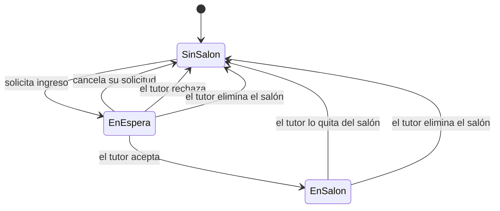

# CodePlay — Estado del proyecto

> Documento de referencia para retomar el desarrollo sin perder contexto.
> Última actualización: **18 de agosto de 2026**.

CodePlay es una plataforma web para enseñar pensamiento computacional a niños,
con un juego de Unity que se integrará más adelante. Este documento mapea qué
está construido, cómo se ve y con qué está hecho.

**Lo primero que hay que entender:** hoy la aplicación funciona **sin backend**.
No hay login real ni base de datos conectada. Todo el estado de salones vive en
`localStorage` del navegador, sembrado con datos de ejemplo. Las pantallas son
reales y navegables; los datos, no.

---

## Índice

1. [Mapa de funcionalidades](#1-mapa-de-funcionalidades)
2. [Guía de estilos](#2-guía-de-estilos)
3. [Herramientas y stack](#3-herramientas-y-stack)
4. [Deuda técnica conocida](#4-deuda-técnica-conocida)

---

## 1. Mapa de funcionalidades

### Leyenda

| Símbolo | Significado |
| --- | --- |
| ✅ **Funcional** | Implementado y operativo sobre el store local. Funcionará igual al conectar el backend. |
| 🟡 **Prototipo** | La interfaz existe y responde, pero no produce el efecto real (no se envía nada, no persiste fuera del navegador). |
| ⛔ **Pendiente** | No existe todavía. |

### 1.1 Rol Tutor

El rol se llama `tutor` en el código y cubre tanto a **padres como a profesores**.
En la interfaz se etiqueta "Tutor"; el nombre del profesor se muestra por salón.

| Funcionalidad | Estado | Dónde vive |
| --- | --- | --- |
| Listado de salones con métricas agregadas | ✅ | `TeacherGroupsModule.tsx` |
| Crear salón (nombre, grado, profesor, cupos) | ✅ | `CreateGroupForm.tsx` |
| Generación de ID público único por salón | ✅ | `generatePublicId()` en `classroomsData.ts` |
| Identidad visual automática por salón | ✅ | `groupThemes.ts` + `GroupBadge.tsx` |
| Detalle del salón con estadísticas | ✅ | `TeacherGroupDetailModule.tsx` |
| Tabla de seguimiento (mundo, actividad, racha) | ✅ | `StudentRosterTable.tsx` |
| Eliminar alumno del salón (con confirmación en línea) | ✅ | `StudentRosterTable.tsx` |
| Eliminar salón (diálogo con recuento de afectados) | ✅ | `ConfirmDialog.tsx` |
| Bandeja "Alumnos en espera" | ✅ | `PendingRequestsSection.tsx` |
| Aceptar / rechazar solicitud de ingreso | ✅ | `ClassroomsProvider.tsx` |
| Reportes de habilidades (5 competencias) | ✅ | `getSkillReports()` |
| Selector de alcance (todos los salones / uno) | ✅ | `TeacherPanelModule.tsx` |
| Asignación de misiones | 🟡 | Estado local del componente; se pierde al recargar |
| Invitar alumnos por correo | 🟡 | Registra la invitación, **no envía ningún correo** |
| Enlace de invitación que lleva al salón | ⛔ | Requiere tokens y backend |
| Recursos educativos | 🟡 | Tarjetas informativas sin destino |
| Ajustes de cuenta | 🟡 | Muestra datos; "Cambiar contraseña" no hace nada |
| Editar o archivar un salón existente | ⛔ | — |
| Exportar reportes | ⛔ | — |

### 1.2 Rol Alumno (niño)

| Funcionalidad | Estado | Dónde vive |
| --- | --- | --- |
| Buscador global de salones | ✅ | `StudentClassroomSearch.tsx` |
| Búsqueda por nombre (coincidencia parcial) | ✅ | `matchesGroupSearch()` |
| Búsqueda por ID exacto (muestra solo ese salón) | ✅ | `matchesGroupSearch()` + `isExactIdSearch()` |
| Solicitar ingreso a un salón | ✅ | `requestJoin()` |
| Pantalla de espera con cancelación | ✅ | `StudentClassroomModule.tsx` |
| Ver el salón propio y a los compañeros | ✅ | `StudentClassroomModule.tsx` |
| Bloqueo de solicitud si el salón está lleno | ✅ | `StudentClassroomSearch.tsx` |
| Listado de mundos | 🟡 | `StudentWorldsModule.tsx` — datos de ejemplo, **con errores de tipos** |
| Niveles de un mundo | 🟡 | `StudentWorldLevelsModule.tsx` |
| Sala de trofeos | 🟡 | `StudentTrophiesModule.tsx` |
| Ajustes de cuenta | 🟡 | `StudentSettingsModule.tsx` |
| Jugar (juego de Unity) | ⛔ | El proyecto de Unity todavía no existe |
| Progreso, XP y rachas reales | ⛔ | Requiere backend |
| Pertenecer a varios salones | ⛔ | El modelo actual admite uno solo |

### 1.3 Transversal

| Funcionalidad | Estado | Notas |
| --- | --- | --- |
| Enrutado y guardas por rol | ✅ | Cada rol es devuelto a su panel si entra en el ajeno |
| Sesión de invitado (entrar sin login) | ✅ | Solo en desarrollo (`import.meta.env.DEV`) |
| Persistencia del estado de salones | ✅ | `localStorage`, un solo navegador |
| Registro y login reales | ⛔ | Formularios existen; Supabase Auth sin conectar |
| Login con Google | ⛔ | `signInWithGoogle` escrito, sin configurar |

### 1.4 Flujos de usuario principales

#### Crear salón

```
Tutor → "Mis salones" → botón "Crear salón"
  → formulario (nombre, grado, profesor, cupos 1-60)
  → validación en cliente
  → createGroup(): genera id interno + publicId único (CP-XXXX) + tema visual
  → se añade al store y redirige a /teacher/groups/{id}
```

#### Invitar por correo — 🟡 prototipo

```
Tutor → detalle del salón → "Invitar"
  → escribe correo → valida formato y duplicados
  → inviteByEmail(): guarda la invitación en estado "pending", normalizada a minúsculas
  → aparece en "Invitaciones enviadas"
  ⚠️ NO se envía ningún correo. El alumno no puede canjearla.
```

#### Solicitar ingreso

```
Alumno sin salón → buscador → busca por nombre o ID
  → "Solicitar ingreso"
  → requestJoin(): crea JoinRequest en el salón + membership = pending
  → el alumno ve la pantalla de espera
  → la solicitud aparece en la bandeja del tutor de ese salón
```

#### Aprobar o rechazar solicitud

```
Tutor → detalle del salón → "Alumnos en espera"
  ├── Aceptar  → acceptRequest(): el niño pasa a la tabla sin actividad previa
  │              si es el alumno de la sesión → membership = member
  └── Rechazar → rejectRequest(): se descarta la solicitud
                 si es el alumno de la sesión → membership = none

Nota: "Aceptar" se deshabilita cuando no quedan cupos libres.
```

#### Eliminar alumno

```
Tutor → tabla de seguimiento → "Quitar"
  → confirmación en línea (Confirmar / Cancelar)
  → removeStudent(): sale de la tabla y los contadores se recalculan
  → si es el alumno de la sesión → membership = none
```

#### Eliminar salón

```
Tutor → detalle del salón → "Eliminar salón"
  → diálogo modal indicando cuántos alumnos y cuántas solicitudes se ven afectados
  → deleteGroup(): el salón desaparece del store
  → todos sus alumnos quedan sin salón
  → si el alumno de la sesión estaba dentro → membership = none
  → redirige a /teacher/groups
```

### 1.5 Estados del alumno



| Estado | `membership.status` | `groupId` | Qué ve el alumno |
| --- | --- | --- | --- |
| Sin salón | `none` | `null` | Buscador global de salones |
| En espera | `pending` | id del salón | Pantalla de espera con opción de cancelar |
| En un salón | `member` | id del salón | Su salón, compañeros y seguimiento |

**Transiciones**

| Desde | Hacia | Disparador | Quién |
| --- | --- | --- | --- |
| Sin salón | En espera | `requestJoin()` | Alumno |
| En espera | Sin salón | `cancelJoinRequest()` | Alumno |
| En espera | Sin salón | `rejectRequest()` | Tutor |
| En espera | En un salón | `acceptRequest()` | Tutor |
| En un salón | Sin salón | `removeStudent()` | Tutor |
| En espera / En un salón | Sin salón | `deleteGroup()` | Tutor |

> No existe transición directa de "En un salón" a "En espera" en otro salón:
> el alumno debe quedar sin salón primero.

---

## 2. Guía de estilos

Referencias estéticas: **CodeCombat, CodeMonkey y Scratch**. La idea rectora es
que todo se vea *tangible* — contornos gruesos, relieve sólido, colores
saturados — en lugar de una interfaz plana y genérica.

Los tokens viven en [`apps/web/src/main.css`](../apps/web/src/main.css) como
variables CSS y en [`apps/web/tailwind.config.js`](../apps/web/tailwind.config.js)
como nombres de Tailwind. **Usa siempre los nombres, no los hex sueltos.**

### 2.1 Paleta

#### Colores de marca

| Nombre | Hex | Tailwind | Uso asignado |
| --- | --- | --- | --- |
| Uva | `#7B3FE4` | `grape` | **Primario.** Acciones principales, navegación activa, títulos |
| Uva oscuro | `#5620B0` | `grape-dark` | Relieve de botones primarios, texto sobre fondo claro |
| Uva claro | `#A77BF3` | `grape-light` | Degradados, foco de campos |
| Uva suave | `#F0E6FF` | `grape-soft` | Fondos de etiquetas y botones secundarios |
| Sol | `#FFC93C` | `sun` | **Secundario.** Rachas, elementos en espera, logo |
| Sol oscuro | `#D99A00` | `sun-dark` | Texto sobre fondo ámbar |
| Sol suave | `#FFF4D6` | `sun-soft` | Fondo de avisos de atención |

#### Colores semánticos

| Nombre | Hex | Tailwind | Uso asignado |
| --- | --- | --- | --- |
| Menta | `#17C3B2` | `mint` | **Éxito.** Confirmaciones, aceptar, rol Tutor, mundo actual |
| Menta oscuro | `#0C8577` | `mint-dark` | Texto de éxito |
| Menta suave | `#D6F7F3` | `mint-soft` | Fondo de mensajes de éxito |
| Coral | `#FF5A5A` | `coral` | **Peligro.** Eliminar, rechazar, cerrar sesión |
| Coral oscuro | `#C72C2C` | `coral-dark` | Texto de error y validación |
| Coral suave | `#FFE6E6` | `coral-soft` | Fondo de alertas destructivas |
| Cielo | `#3B9DF8` | `sky` | **Informativo.** Cupos, datos neutros |
| Lima | `#7ED957` | `lime` | Barras de dominio alto (≥ 70 %) |
| Chicle | `#FF7BC2` | `bubble` | Acento decorativo y temas de salón |

#### Neutros y fondos

Todos los neutros llevan un tinte violeta deliberado: evita el gris apagado que
haría la interfaz menos infantil.

| Nombre | Hex | Tailwind | Uso asignado |
| --- | --- | --- | --- |
| Tinta | `#2A1B45` | `ink` | Texto principal **y todos los contornos** |
| Tinta suave | `#5A5170` | `ink-soft` | Texto secundario y descripciones |
| Tinta tenue | `#8B82A6` | `ink-faint` | Texto terciario, vacíos, marcadores de posición |
| Crema | `#FFF9EF` | `cream` | Fondo de campos, filas alternas, cajas internas |
| Lavanda | `#F4EEFF` | `lavender` | **Fondo de la aplicación** |
| Línea | `#E3D9F7` | `line` | Bordes suaves y lunares del fondo |

El fondo de la aplicación no es un plano liso: lleva una trama de lunares de
`line` sobre `lavender`, con `background-size: 26px 26px`.

#### Semáforo de dominio de habilidades

| Rango | Color | Lectura |
| --- | --- | --- |
| ≥ 70 % | `lime` | Dominado |
| 45 – 69 % | `sun` | En camino |
| < 45 % | `coral` | A reforzar |

### 2.2 Tipografía

| Familia | Uso | Pesos | Origen |
| --- | --- | --- | --- |
| **Fredoka** | Títulos, botones, etiquetas, números destacados | 500, 600, 700 | Google Fonts |
| **Quicksand** | Cuerpo de texto, párrafos, tablas | 500, 600, 700 | Google Fonts |

Ambas son redondeadas y de alta legibilidad. El cuerpo arranca en **peso 600**
por defecto: en una interfaz infantil el texto fino se lee peor.

Aplicación automática: `h1`–`h4` reciben Fredoka mediante una regla global en
`main.css`. Para usar Fredoka fuera de un encabezado, aplica `font-display`.

#### Jerarquía

| Clase | Tamaño | Familia | Uso |
| --- | --- | --- | --- |
| `.title-xl` | 32 px | Fredoka | Título de página (`h1`) |
| `.title-lg` | 24 px | Fredoka | Título de sección (`h2`) |
| — | 19–24 px | Fredoka | Títulos de tarjeta (`h3`) |
| `.subtitle` | 16 px | Quicksand 600 | Descripción bajo un título |
| — | 16 px | Quicksand 600–700 | Cuerpo y celdas de tabla |
| — | 14–15 px | Quicksand 600 | Texto secundario |
| `.field-label` | 14 px | Quicksand 700 | Etiquetas de formulario |
| — | 13 px / mayúsculas | Quicksand 700 | Encabezados de dato, `tracking: 0.05em` |

### 2.3 Componentes reutilizables

#### Botones — clases CSS

Base `.btn` + un modificador de color. Miden **52 px** de alto (40 px con
`.btn-sm`), tienen redondeo completo y un **borde inferior de 5 px** en el tono
oscuro que produce el relieve.

| Clase | Color | Uso |
| --- | --- | --- |
| `.btn .btn-grape` | Uva | Acción principal |
| `.btn .btn-mint` | Menta | Confirmar, aceptar |
| `.btn .btn-sun` | Sol | Acción destacada secundaria (texto en tinta) |
| `.btn .btn-coral` | Coral | Destructiva |
| `.btn .btn-sky` | Cielo | Informativa |
| `.btn .btn-ghost` | Uva suave | Secundaria, cancelar |
| `.btn-sm` | — | Modificador de tamaño reducido |

**Estados:** `hover` aplica `brightness(1.06)`; `active` baja el botón 3 px y
reduce el borde inferior a 2 px — el relieve se hunde de verdad; `disabled`
aplica escala de grises al 50 % y opacidad 0,65.

#### Tarjetas

| Clase | Descripción |
| --- | --- |
| `.card` | Contorno de 3 px en tinta, radio 26 px, sombra sólida `0 8px 0` — aspecto de pegatina |
| `.card-flat` | Variante ligera: borde de 2 px en `line`, radio 22 px, sin sombra |

#### Etiquetas de estado

Base `.chip` (Fredoka 13 px, radio completo) más color: `.chip-grape`,
`.chip-mint`, `.chip-sun`, `.chip-coral`, `.chip-sky`.

| Etiqueta | Color | Significado |
| --- | --- | --- |
| Tutor | menta | Rol del usuario |
| En espera / Pendiente | sol | Solicitud o invitación sin resolver |
| Dificultad de misión | uva | Fácil / Intermedio / Difícil |
| Habilidad | menta | Competencia que entrena una misión |

#### Campos de formulario

`.field` — 52 px de alto, fondo crema, borde de 3 px en `line`, radio 16 px. Al
enfocar, el borde pasa a `grape-light` y el fondo a blanco. Etiquetas con
`.field-label`.

#### Componentes React compartidos

| Componente | Ruta | Función |
| --- | --- | --- |
| `ConfirmDialog` | `components/dashboard/shared/` | Modal de confirmación destructiva. Cierra con Escape o clic fuera |
| `StatCard` | `components/dashboard/shared/` | Métrica con icono en burbuja. Prop `tone` |
| `StudentRosterTable` | `components/dashboard/shared/` | Tabla de seguimiento. La columna de acciones solo aparece si se pasa `onRemoveStudent` |
| `GroupBadge` | `components/dashboard/shared/` | Insignia ilustrada del salón según su tema |

#### Identidad visual de los salones

Cada salón recibe uno de **seis temas** de forma determinista, mediante hash de
su id (`getGroupTheme()`). No se guarda en base de datos: el mismo salón siempre
obtiene el mismo tema.

| Tema | Color | Hex |
| --- | --- | --- |
| Cohete | Uva | `#7B3FE4` |
| Robot | Cielo | `#3B9DF8` |
| Dinosaurio | Lima | `#7ED957` |
| Estrella | Sol | `#FFC93C` |
| Bosque | Menta | `#17C3B2` |
| Océano | Chicle | `#FF7BC2` |

Cada tema aporta color sólido, degradado de cabecera (135°, claro → saturado) y
una **ilustración SVG propia**, presente en la tarjeta, la barra lateral y la
vista del alumno.

### 2.4 Espaciado, radios y sombras

#### Radios

| Valor | Uso |
| --- | --- |
| `9999px` | Botones, etiquetas, avatares, barras de progreso |
| `26px` | Tarjetas principales (`.card`, `rounded-chunk`) |
| `20–22px` | Insignias, cajas internas, `.card-flat` |
| `16–18px` | Campos, elementos de navegación, avisos |

#### Sombras

Nunca difuminadas: siempre desplazamiento sólido en vertical, que es lo que
produce la sensación de relieve.

| Token | Valor | Uso |
| --- | --- | --- |
| `shadow-chunk` | `0 8px 0 rgba(42,27,69,0.12)` | Tarjetas |
| `shadow-chunk-lg` | `0 12px 0 rgba(42,27,69,0.14)` | Elementos elevados |
| — | `0 4px 0 rgba(42,27,69,0.15–0.25)` | Insignias, navegación activa |
| — | `0 16px 0 rgba(42,27,69,0.18)` | Modales |

#### Espaciado

Escala de 4 px (la de Tailwind). Ritmos habituales:

| Contexto | Valor |
| --- | --- |
| Relleno de página | `px-5 py-5` (20 px) |
| Relleno de tarjeta | `px-5 py-4` a `p-6` |
| Separación entre secciones | `mt-6` a `mt-8` (24–32 px) |
| Rejilla de tarjetas | `gap-5` / `gap-6` |
| Grupos de botones | `gap-3` |
| Altura de barras superiores | 84 px |
| Ancho de barras laterales | 262 px |
| Grosor de contornos | 3 px estructural, 2 px secundario |

---

## 3. Herramientas y stack

### 3.1 Versiones

Entorno de referencia: **Node.js 22.17.1**, **npm 10.9.2**.

#### Núcleo

| Paquete | Versión | Para qué |
| --- | --- | --- |
| `react` / `react-dom` | 18.3.1 | Interfaz |
| `react-router-dom` | 6.30.6 | Enrutado |
| `typescript` | 5.9.3 | Tipado, modo estricto |
| `vite` | 5.4.21 | Servidor de desarrollo y empaquetado |
| `@vitejs/plugin-react` | 4.7.0 | Fast Refresh y JSX |
| `tailwindcss` | 3.4.19 | Estilos |
| `postcss` / `autoprefixer` | 8.5.26 / 10.5.4 | Procesado de CSS |

#### Dependencias presentes, aún sin uso real

| Paquete | Versión | Estado |
| --- | --- | --- |
| `@supabase/supabase-js` | 2.112.3 | Cliente y servicios escritos; sin proyecto conectado, ninguna consulta llega a resolverse |
| `zod` | 3.25.76 | Valida las variables de entorno (`config/env.ts`) y los esquemas de login y registro |
| `framer-motion` | 10.18.0 | **Sin uso.** Candidato a eliminar si no se anima nada |

#### Calidad

| Paquete | Versión |
| --- | --- |
| `eslint` | 8.57.1 (config heredada `.eslintrc.cjs`) |
| `@typescript-eslint/*` | 6.x |
| `prettier` | 3.9.6 |

> ESLint 8 dejó de recibir soporte. Migrar a ESLint 9 con configuración plana es
> una tarea pendiente sin urgencia.

### 3.2 Puesta en marcha

```bash
npm install
```

Un solo `npm install` en la raíz resuelve todos los paquetes: es un monorepo con
npm workspaces y un `node_modules` compartido.

Variables de entorno del front:

```bash
cp apps/web/.env.example apps/web/.env
```

| Variable | Descripción |
| --- | --- |
| `VITE_SUPABASE_URL` | URL del proyecto de Supabase |
| `VITE_SUPABASE_ANON_KEY` | Clave pública (anon) |

> La aplicación arranca aunque estas variables estén vacías: ninguna pantalla
> construida hasta ahora depende de Supabase.

```bash
npm run dev
```

#### Comandos

| Comando | Qué hace |
| --- | --- |
| `npm run dev` | Servidor de desarrollo en el puerto 5173 |
| `npm run build` | Chequeo de tipos + build de producción — **hoy falla**, ver §4 |
| `npm run preview` | Sirve el build de producción |
| `npm run lint` | ESLint sin tolerancia a warnings — **hoy falla**, ver §4 |
| `npm run format` | Prettier sobre `src` |

Para operar sobre un workspace concreto: `npm run <script> -w @codeplay/web`.
Para instalar una dependencia solo en el front: `npm install <paquete> -w @codeplay/web`.

### 3.3 Estructura de carpetas

```
codeplayPGrado/
├── apps/
│   ├── web/                  Front-end (React + TS + Vite + Tailwind)
│   └── game/                 Proyecto de Unity (pendiente de crear)
├── packages/                 Código compartido entre apps (vacío)
├── supabase/                 Esquema de base de datos
│   └── migrations/           22 migraciones SQL (la siembra vive en la 0012,
│                             no hay seed.sql suelto)
├── docs/                     Este documento
├── package.json              Raíz del monorepo (npm workspaces)
├── .eslintrc.cjs             Config de ESLint compartida
├── .prettierrc               Config de Prettier compartida
└── .gitattributes            Normalización de fin de línea + reglas de Unity
```

#### Dentro de `apps/web/src`

| Carpeta | Contenido |
| --- | --- |
| `components/dashboard/teacher/` | Todo el panel del tutor (11 archivos) y `classroomsData.ts`, que reúne los datos de ejemplo y las funciones puras de cálculo |
| `components/dashboard/student/` | Módulos del alumno: salón, buscador, mundos, trofeos, ajustes |
| `components/dashboard/shared/` | Componentes usados por ambos roles y los temas de salón |
| `components/dashboard/Sidebar/` | Barra lateral del alumno |
| `components/home/` | Navbar y secciones de la landing |
| `components/auth/`, `components/ui/` | Formularios de acceso y primitivas antiguas |
| `context/` | `AuthProvider` (Supabase), `ClassroomsProvider` (store de salones), helpers de rol y de sesión de invitado |
| `hooks/` | `useAuth`, `useClassrooms`, `useActiveRole` y hooks de datos aún sin conectar |
| `services/` | 7 servicios de Supabase. Los consumen `AuthProvider` y los hooks de datos; **ninguna pantalla de salones los usa** |
| `types/` | Tipos de dominio. `classroom.types.ts` es el modelo vivo; `database.types.ts` está desincronizado |
| `router/` | `AppRouter` y las guardas `PrivateRoute` / `PublicRoute` |
| `pages/` | Un componente por pantalla de nivel superior |
| `constants/`, `config/`, `lib/`, `errors/` | Rutas, entorno, cliente de Supabase, tipos de error |

#### Rutas

| Ruta | Rol | Pantalla |
| --- | --- | --- |
| `/` | Público | Landing |
| `/login`, `/signup` | Público | Acceso y registro |
| `/dashboard`, `/dashboard/worlds` | Alumno | Mundos |
| `/dashboard/worlds/:worldId` | Alumno | Niveles de un mundo |
| `/dashboard/trophies` | Alumno | Sala de trofeos |
| `/dashboard/classroom` | Alumno | Salón / buscador / espera |
| `/dashboard/settings` | Alumno | Ajustes |
| `/teacher` | Tutor | Redirige a `/teacher/groups` |
| `/teacher/groups` | Tutor | Mis salones |
| `/teacher/groups/:groupId` | Tutor | Detalle del salón |
| `/teacher/panel`, `/teacher/panel/:groupId` | Tutor | Panel de información |
| `/teacher/settings` | Tutor | Ajustes de cuenta |

Quien entra en un panel que no le corresponde es redirigido al suyo.

#### Claves de `localStorage`

| Clave | Contenido |
| --- | --- |
| `codeplay:classrooms` | Estado completo de salones y pertenencia. Versionado (`version: 1`); si la versión no cuadra, se resiembra |
| `dev:skipAuth` | Marca de sesión de invitado. Solo en desarrollo |
| `dev:guestRole` | Rol de la sesión de invitado: `child` o `tutor` |

### 3.4 Herramientas pendientes de integrar

| Herramienta | Necesaria para | Situación |
| --- | --- | --- |
| **Supabase Postgres** | Persistir salones, solicitudes, alumnos y progreso entre dispositivos | Proyecto y CLI sin conectar. Faltan tablas de salones |
| **Supabase Auth** | Login real, distinguir tutor de alumno en el servidor | `auth.service.ts` escrito; falta configurar el proyecto |
| **Google OAuth** | Acceso con Google | `signInWithGoogle()` escrito; falta darlo de alta |
| **Servicio de correo** (Resend, SendGrid o similar) | Enviar de verdad las invitaciones | Sin elegir. Es el bloqueo de la funcionalidad 🟡 más visible |
| **Supabase Edge Functions** | Generar y canjear los enlaces de invitación con token | Sin empezar |
| **Unity + WebGL** | El juego | El proyecto irá en `apps/game/`; el build en `apps/web/public/game/` |
| **Git LFS** | Binarios de Unity (texturas, audio, modelos) | Reglas preparadas y comentadas en `.gitattributes`. **Activar antes del primer commit de Unity** |
| **CI (GitHub Actions)** | Verificar lint y build en cada push | Sin configurar |

#### Qué desbloquea cada pieza

| Si conectas… | Se vuelve funcional |
| --- | --- |
| Postgres + Auth | Todo el store de salones deja de ser local: solicitudes reales entre dispositivos, roles verificados en servidor |
| Servicio de correo + Edge Functions | Invitación por correo completa, con enlace que mete al alumno en el salón |
| Postgres (tabla de habilidades) | Reportes calculados sobre progreso real en vez de datos de ejemplo |
| Unity WebGL | Jugar, y con ello progreso, XP y rachas auténticas |

---

## 4. Deuda técnica conocida

Cuatro cosas que conviene atacar antes de seguir añadiendo funcionalidad.

### 4.1 `npm run build` y `npm run lint` fallan

Los tres errores están en el **mismo archivo**,
[`StudentWorldsModule.tsx`](../apps/web/src/components/dashboard/student/StudentWorldsModule.tsx),
y son anteriores a todo el trabajo reciente:

| Línea | Problema |
| --- | --- |
| 233 | `difficultyLabel: w.name ? 'Fácil' : 'Fácil'` — el ternario ensancha el tipo a `string` y deja de encajar con `'Fácil' \| 'Intermedio' \| 'Difícil'`. Rompe `tsc` |
| 200 | `as any` sobre el mapeo de `fallbackWorlds` — viola la regla de ESLint |
| 234 | `(w as any).difficulty` — viola la regla de ESLint |

Son correcciones de una línea cada una. Mientras sigan ahí, **no hay build de
producción posible** y el CI no podrá ponerse en verde.

### 4.2 `database.types.ts` no describe la base de datos real

El archivo declara campos que **no existen** en las migraciones:

| `database.types.ts` declara | La tabla `profiles` tiene realmente |
| --- | --- |
| `role`, `email`, `avatar_url`, `streak_days`, `xp` | `username`, `full_name`, `avatar_key`, `country_code`, `total_xp`, `current_streak`, `max_streak` |

Consecuencias: **no hay columna `role`**, así que el backend no puede distinguir
tutor de alumno; y todo lo que dependa de `user.streakDays`, `user.xp` o
`user.email` fallará en cuanto se conecte Supabase.

Ese archivo debe **regenerarse**, no editarse a mano:

```bash
supabase gen types typescript --local > apps/web/src/types/database.types.ts
```

### 4.3 Faltan tablas de salones

No existe nada equivalente a `ClassGroup`. Como mínimo harán falta:

| Tabla | Para qué |
| --- | --- |
| `class_groups` | Salón: profesor, nombre, grado, id público, cupos |
| `class_memberships` | Relación alumno ↔ salón |
| `join_requests` | Solicitudes pendientes con su estado |
| `invitations` | Invitaciones por correo con token y caducidad |
| `profiles.role` | Columna nueva para distinguir `child` de `tutor` |

**Los puntos 4.2 y 4.3 se solapan: conviene resolverlos en una sola tanda.**

### 4.4 Aislamiento del store

`ClassroomsProvider` es el único archivo que cambia de raíz al conectar el
backend. Todos los componentes consumen los datos vía `useClassrooms()`, así que
sustituir el estado local por consultas **no obliga a tocar ninguna vista**. Se
diseñó así a propósito; conviene mantener esa frontera.

### 4.5 Alcance del rediseño

El sistema visual (tipografías, paleta, fondo) se aplica globalmente, pero estas
pantallas conservan su maquetación y colores originales y desentonarán de cerca:

- Secciones de la landing (héroe, cómo se aprende, tutores, pie)
- Login y registro
- Módulos del alumno: Mundos, Sala de Trofeos, Ajustes

---

## Resumen para quien retoma esto

1. Ejecuta `npm install` y `npm run dev`. Entra con los botones **Sin login** de
   la barra superior: elige *Niño* o *Profesor*.
2. Para reiniciar los datos de ejemplo, borra la clave `codeplay:classrooms` de
   `localStorage`.
3. Antes de tocar nada: arregla los tres errores de `StudentWorldsModule.tsx`
   (§4.1) para recuperar el build.
4. El siguiente hito grande es el esquema de base de datos (§4.2 y §4.3). Sin él,
   todo lo demás sigue siendo una demostración de un solo navegador.
